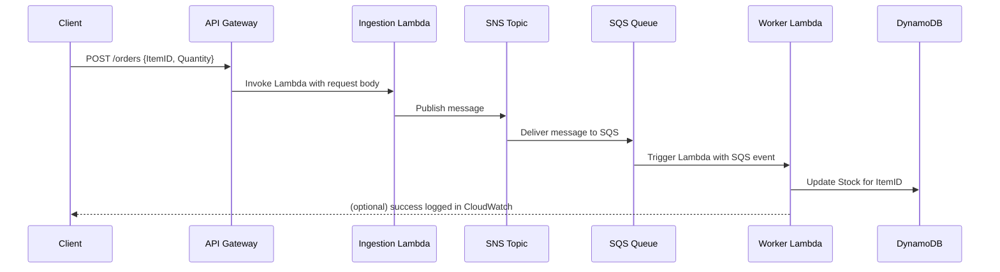

# edo-system

**edo-system** is a fully serverless, event‑driven order processing platform built on AWS.  
It’s designed to be modular, scalable, and production‑ready — the kind of architecture you’d expect in a modern cloud environment.

The system handles incoming orders, validates them, publishes events, processes inventory updates, and stores results in DynamoDB. Everything is decoupled, everything is asynchronous, and everything scales automatically.

---

## 🚀 What This Project Does

At a high level, the workflow looks like this:

1. **API Gateway** receives an order request  
2. **Ingestion Lambda** validates the payload and publishes an event  
3. **SNS** fans out the message to subscribed queues  
4. **SQS** buffers messages for reliable processing  
5. **Worker Lambda** consumes messages and updates DynamoDB  
6. **DynamoDB** stores inventory and order state  
7. **CloudWatch** provides logs, metrics, and operational visibility  

This pattern gives you fault tolerance, horizontal scalability, and clean separation between ingestion and processing.

---

## 🏗️ Architecture Diagram

Located in `docs/architecture-diagram.png`.

```mermaid
flowchart LR
    Client -->|POST /orders| APIGW[API Gateway]
    APIGW --> IngestionLambda[Ingestion Lambda]
    IngestionLambda --> SNS[Order SNS Topic]
    SNS --> SQS[Inventory SQS Queue]
    SQS --> WorkerLambda[Inventory Worker Lambda]
    WorkerLambda --> DynamoDB[Inventory DynamoDB Table]
    WorkerLambda --> CloudWatch[CloudWatch Logs & Metrics]

---

## 📁 Project Structure

edo-system/
│
├── infrastructure/
│   ├── template.yaml
│   ├── parameters/
│   │   └── prod.json
│   └── scripts/
│       └── deploy.sh
│
├── services/
│   ├── ingestion-service/
│   │   ├── app.py
│   │   ├── requirements.txt
│   │   └── __init__.py
│   │
│   ├── inventory-worker/
│   │   ├── app.py
│   │   ├── requirements.txt
│   │   └── __init__.py
│
├── shared/
│   ├── utils.py
│   ├── logging.py
│   └── models.py
│
├── tests/
│   ├── test_ingestion.py
│   ├── test_worker.py
│   └── test_utils.py
│
├── docs/
│   ├── architecture-diagram.png
│   ├── sequence-diagram.png
│   └── README.md
│
└── README.md

### Folder Breakdown

| Folder | Purpose |
| --- | --- |
| **services/** | Lambda microservices (ingestion + worker) |
| **shared/** | Reusable utilities shared across services |
| **infrastructure/** | SAM template + deployment scripts |
| **docs/** | Architecture diagrams + documentation |
| **tests/** | Unit tests |

---

## 🔌 API Endpoints

### **POST /orders**

Submit a new order:

```json
{
  "ItemID": "LAPTOP-001",
  "Quantity": 1
}
```

This kicks off the entire event-driven pipeline.

---

## 🛠️ Local Development

Install dependencies for each service:

```bash
pip install -r services/ingestion-service/requirements.txt
pip install -r services/inventory-worker/requirements.txt
```

---

## 🚢 Deployment

From the infrastructure directory:

```bash
cd edo-system/infrastructure
sam build
sam deploy --guided
```

After the first deploy:

```bash
sam deploy
```

---

## 🧪 Testing

Run the full tests suits:

```bash
pytest tests/
```

---

## 📈 Features

- Fully serverless architecture  
- Event-driven design using SNS + SQS  
- Decoupled microservices  
- Real-time inventory updates  
- Scalable and fault-tolerant  
- Clean, modular folder structure  
- Production-ready SAM template  

---

## 📘 Sequence Diagram



---

## 🔧 CI/CD Pipeline (GitHub Actions)

Create `.github/workflows/deploy.yaml`:

```yaml
name: Deploy edo-system

on:
  push:
    branches: [ main ]

jobs:
  build-and-deploy:
    runs-on: ubuntu-latest

    steps:
      - name: Checkout
        uses: actions/checkout@v4

      - name: Set up Python
        uses: actions/setup-python@v5
        with:
          python-version: '3.11'

      - name: Install SAM CLI
        uses: aws-actions/setup-sam@v2

      - name: Configure AWS credentials
        uses: aws-actions/configure-aws-credentials@v4
        with:
          aws-access-key-id: ${{ secrets.AWS_ACCESS_KEY_ID }}
          aws-secret-access-key: ${{ secrets.AWS_SECRET_ACCESS_KEY }}
          aws-region: eu-west-2

      - name: Build
        working-directory: edo-system/infrastructure
        run: sam build

      - name: Deploy
        working-directory: edo-system/infrastructure
        run: sam deploy --no-confirm-changeset --no-fail-on-empty-changeset --stack-name edo-system --capabilities CAPABILITY_IAM
```

---

## 🧭 Future Enhancements

- Add Dead-Letter Queue (DLQ)  
- Add CloudWatch alarms  
- Add retry logic and error handling  
- Add GET `/stock/{itemId}` endpoint  
- Add POST `/stock/add` admin endpoint  
- Add CI/CD pipeline enhancements  
- Add authentication (Cognito or IAM)  

---

## 👤 Author

Designed and implemented as a clean, modern, individually‑crafted cloud engineering project.

